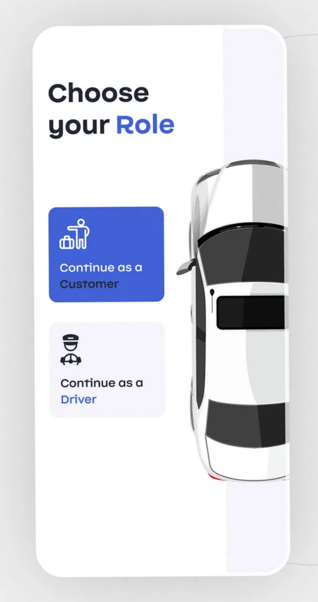
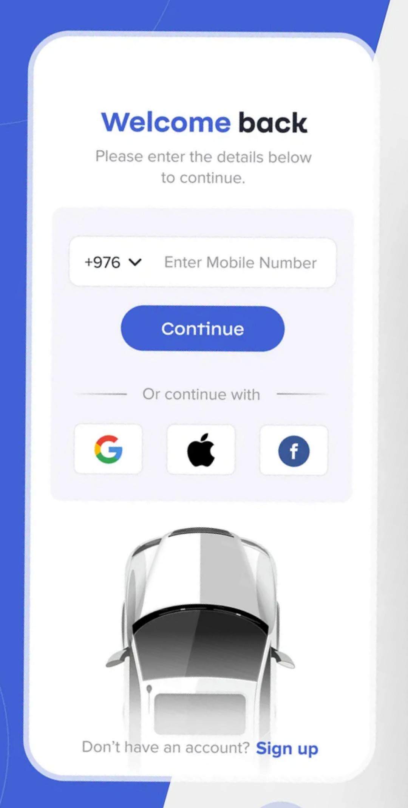
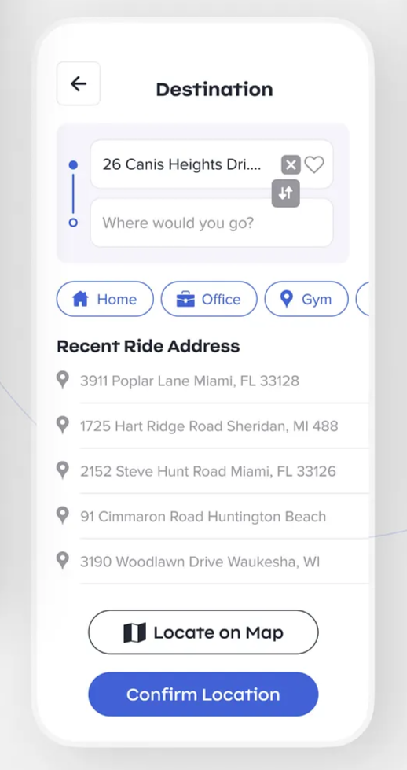
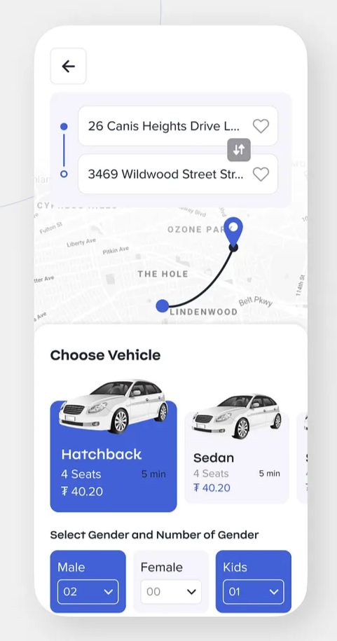
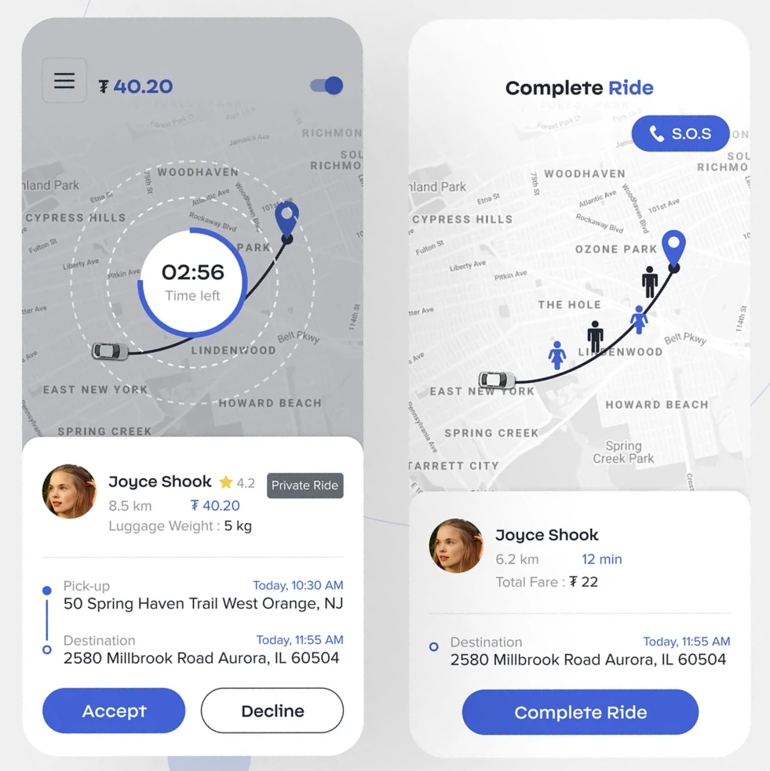

# 🔄 **Complete Real-time Workflow:**


```bash
npm install express socket.io cors body-parser jsonwebtoken bcryptjs
```

`BACKEND SERVER (Node.js + Express + Socket.io)`

```js
const express = require('express');
const http = require('http');
const socketIo = require('socket.io');
const cors = require('cors');
const bodyParser = require('body-parser');

const app = express();
const server = http.createServer(app);
const io = socketIo(server, {
  cors: {
    origin: "*",
    methods: ["GET", "POST"]
  }
});

app.use(cors());
app.use(bodyParser.json());

// In-memory storage (replace with actual database)
let rides = [];
let users = [];
let drivers = [];
let vehicles = [];
let connectedClients = {}; // Track connected users

// Socket connection handler
io.on('connection', (socket) => {
  console.log('User connected:', socket.id);

  // User joins their specific room based on role and ID
  socket.on('join_room', (userData) => {
    const { userId, role } = userData;
    socket.join(`${role}_${userId}`);
    
    // Store connection info
    connectedClients[socket.id] = { userId, role, socketId: socket.id };
    
    // HR users join general HR room for ride requests
    if (role === 'hr') {
      socket.join('hr_room');
    }
    
    console.log(`${role} ${userId} joined room`);
  });

  socket.on('disconnect', () => {
    delete connectedClients[socket.id];
    console.log('User disconnected:', socket.id);
  });
});


// API ROUTES
// Customer creates a ride request
app.post('/api/rides/create', (req, res) => {
  try {
    const { customerId, pickupLocation, dropLocation, scheduledTime } = req.body;
    
    // Create new ride request
    const newRide = {
      id: Date.now().toString(),
      customerId,
      pickupLocation,
      dropLocation,
      scheduledTime,
      status: 'pending',
      createdAt: new Date(),
      driverId: null,
      vehicleId: null
    };
    
    // Save to database (in-memory for demo)
    rides.push(newRide);
    
    // REAL-TIME: Instantly notify all HR dashboards
    io.to('hr_room').emit('new_ride_request', {
      type: 'NEW_RIDE_REQUEST',
      ride: newRide,
      message: `New ride request from customer ${customerId}`
    });
    
    console.log('New ride request created and sent to HR dashboards');
    
    res.json({
      success: true,
      message: 'Ride request created successfully',
      rideId: newRide.id
    });
    
  } catch (error) {
    res.status(500).json({ success: false, error: error.message });
  }
});

// HR approves ride and assigns driver/vehicle
app.post('/api/rides/approve', (req, res) => {
  try {
    const { rideId, driverId, vehicleId, hrId } = req.body;
    
    // Find the ride
    const rideIndex = rides.findIndex(r => r.id === rideId);
    if (rideIndex === -1) {
      return res.status(404).json({ success: false, message: 'Ride not found' });
    }
    
    // Update ride with assignment
    rides[rideIndex] = {
      ...rides[rideIndex],
      status: 'approved',
      driverId,
      vehicleId,
      approvedBy: hrId,
      approvedAt: new Date()
    };
    
    const approvedRide = rides[rideIndex];
    
    // Get driver and vehicle details (mock data for demo)
    const driver = { id: driverId, name: 'John Doe', phone: '+1234567890' };
    const vehicle = { id: vehicleId, model: 'Toyota Camry', plateNumber: 'ABC-123' };
    
    // REAL-TIME: Notify customer about ride approval
    io.to(`customer_${approvedRide.customerId}`).emit('ride_approved', {
      type: 'RIDE_APPROVED',
      ride: approvedRide,
      driver,
      vehicle,
      message: 'Your ride has been approved and driver assigned!'
    });
    
    // REAL-TIME: Notify assigned driver about new ride
    io.to(`driver_${driverId}`).emit('ride_assigned', {
      type: 'RIDE_ASSIGNED',
      ride: approvedRide,
      customer: { id: approvedRide.customerId },
      message: 'New ride assigned to you'
    });
    
    // REAL-TIME: Update all HR dashboards
    io.to('hr_room').emit('ride_status_updated', {
      type: 'RIDE_APPROVED',
      ride: approvedRide,
      message: `Ride ${rideId} approved and assigned`
    });
    
    console.log(`Ride ${rideId} approved and notifications sent`);
    
    res.json({
      success: true,
      message: 'Ride approved and assigned successfully',
      ride: approvedRide
    });
    
  } catch (error) {
    res.status(500).json({ success: false, error: error.message });
  }
});

// HR rejects ride request
app.post('/api/rides/reject', (req, res) => {
  try {
    const { rideId, reason, hrId } = req.body;
    
    const rideIndex = rides.findIndex(r => r.id === rideId);
    if (rideIndex === -1) {
      return res.status(404).json({ success: false, message: 'Ride not found' });
    }
    
    rides[rideIndex] = {
      ...rides[rideIndex],
      status: 'rejected',
      rejectionReason: reason,
      rejectedBy: hrId,
      rejectedAt: new Date()
    };
    
    const rejectedRide = rides[rideIndex];
    
    // REAL-TIME: Notify customer about rejection
    io.to(`customer_${rejectedRide.customerId}`).emit('ride_rejected', {
      type: 'RIDE_REJECTED',
      ride: rejectedRide,
      reason,
      message: 'Your ride request has been rejected'
    });
    
    // REAL-TIME: Update HR dashboards
    io.to('hr_room').emit('ride_status_updated', {
      type: 'RIDE_REJECTED',
      ride: rejectedRide,
      message: `Ride ${rideId} rejected`
    });
    
    res.json({
      success: true,
      message: 'Ride rejected successfully'
    });
    
  } catch (error) {
    res.status(500).json({ success: false, error: error.message });
  }
});

// Get available drivers and vehicles
app.get('/api/resources/available', (req, res) => {
  // Mock data - replace with actual database queries
  const availableDrivers = [
    { id: 'driver1', name: 'John Doe', status: 'available' },
    { id: 'driver2', name: 'Jane Smith', status: 'available' },
    { id: 'driver3', name: 'Mike Johnson', status: 'available' }
  ];
  
  const availableVehicles = [
    { id: 'vehicle1', model: 'Toyota Camry', plateNumber: 'ABC-123', status: 'available' },
    { id: 'vehicle2', model: 'Honda Civic', plateNumber: 'XYZ-789', status: 'available' },
    { id: 'vehicle3', model: 'Nissan Altima', plateNumber: 'DEF-456', status: 'available' }
  ];
  
  res.json({
    success: true,
    drivers: availableDrivers,
    vehicles: availableVehicles
  });
});

// Start server
const PORT = process.env.PORT || 3001;
server.listen(PORT, () => {
  console.log(`Server running on port ${PORT}`);
});
```

`Taxi App (React Native)`
```js
// CustomerApp.js
import React, { useState, useEffect } from 'react';
import { View, Text, TextInput, TouchableOpacity, Alert, StyleSheet } from 'react-native';
import io from 'socket.io-client';

const CustomerApp = () => {
  const [socket, setSocket] = useState(null);
  const [pickupLocation, setPickupLocation] = useState('');
  const [dropLocation, setDropLocation] = useState('');
  const [customerId] = useState('customer123'); // In real app, get from auth
  const [rideStatus, setRideStatus] = useState('');

  useEffect(() => {
    // Initialize socket connection
    const socketConnection = io('http://localhost:3001');
    setSocket(socketConnection);

    // Join customer room for real-time updates
    socketConnection.emit('join_room', {
      userId: customerId,
      role: 'customer'
    });

    // Listen for ride approval
    socketConnection.on('ride_approved', (data) => {
      console.log('Ride approved:', data);
      setRideStatus('approved');
      
      // Show popup notification
      Alert.alert(
        'Ride Approved! 🎉',
        `Your ride has been approved!\n\nDriver: ${data.driver.name}\nPhone: ${data.driver.phone}\nVehicle: ${data.vehicle.model}\nPlate: ${data.vehicle.plateNumber}`,
        [{ text: 'OK', onPress: () => console.log('OK Pressed') }]
      );
    });

    // Listen for ride rejection
    socketConnection.on('ride_rejected', (data) => {
      console.log('Ride rejected:', data);
      setRideStatus('rejected');
      
      Alert.alert(
        'Ride Rejected ❌',
        `Sorry, your ride request has been rejected.\n\nReason: ${data.reason}`,
        [{ text: 'OK', onPress: () => console.log('OK Pressed') }]
      );
    });

    return () => {
      socketConnection.disconnect();
    };
  }, [customerId]);

  const createRideRequest = async () => {
    if (!pickupLocation || !dropLocation) {
      Alert.alert('Error', 'Please fill in both pickup and drop locations');
      return;
    }

    try {
      const response = await fetch('http://localhost:3001/api/rides/create', {
        method: 'POST',
        headers: {
          'Content-Type': 'application/json',
        },
        body: JSON.stringify({
          customerId,
          pickupLocation,
          dropLocation,
          scheduledTime: new Date()
        }),
      });

      const result = await response.json();
      
      if (result.success) {
        setRideStatus('pending');
        Alert.alert('Success', 'Ride request sent! Waiting for approval...');
      } else {
        Alert.alert('Error', result.message);
      }
    } catch (error) {
      Alert.alert('Error', 'Failed to create ride request');
      console.error('Error:', error);
    }
  };

  return (
    <View style={styles.container}>
      <Text style={styles.title}>Book a Ride</Text>
      
      <TextInput
        style={styles.input}
        placeholder="Pickup Location"
        value={pickupLocation}
        onChangeText={setPickupLocation}
      />
      
      <TextInput
        style={styles.input}
        placeholder="Drop Location"
        value={dropLocation}
        onChangeText={setDropLocation}
      />
      
      <TouchableOpacity style={styles.button} onPress={createRideRequest}>
        <Text style={styles.buttonText}>Request Ride</Text>
      </TouchableOpacity>
      
      {rideStatus && (
        <Text style={styles.status}>
          Status: {rideStatus.toUpperCase()}
        </Text>
      )}
    </View>
  );
};

export default CustomerApp;
```


`HR DASHBOARD (React Web Application)`

```js
// HRDashboard.js
import React, { useState, useEffect } from 'react';
import io from 'socket.io-client';
import './HRDashboard.css';

const HRDashboard = () => {
  const [socket, setSocket] = useState(null);
  const [pendingRides, setPendingRides] = useState([]);
  const [approvedRides, setApprovedRides] = useState([]);
  const [availableDrivers, setAvailableDrivers] = useState([]);
  const [availableVehicles, setAvailableVehicles] = useState([]);
  const [hrId] = useState('hr123'); // In real app, get from auth

  useEffect(() => {
    // Initialize socket connection
    const socketConnection = io('http://localhost:3001');
    setSocket(socketConnection);

    // Join HR room for real-time updates
    socketConnection.emit('join_room', {
      userId: hrId,
      role: 'hr'
    });

    // Listen for new ride requests
    socketConnection.on('new_ride_request', (data) => {
      console.log('New ride request received:', data);
      
      // Add to pending rides list
      setPendingRides(prev => [...prev, data.ride]);
      
      // Show browser notification
      if (Notification.permission === 'granted') {
        new Notification('New Ride Request', {
          body: `From: ${data.ride.pickupLocation} To: ${data.ride.dropLocation}`,
          icon: '/taxi-icon.png'
        });
      }
      
      // Play notification sound
      playNotificationSound();
    });

    // Listen for ride status updates
    socketConnection.on('ride_status_updated', (data) => {
      console.log('Ride status updated:', data);
      
      if (data.type === 'RIDE_APPROVED') {
        // Move from pending to approved
        setPendingRides(prev => prev.filter(ride => ride.id !== data.ride.id));
        setApprovedRides(prev => [...prev, data.ride]);
      } else if (data.type === 'RIDE_REJECTED') {
        // Remove from pending
        setPendingRides(prev => prev.filter(ride => ride.id !== data.ride.id));
      }
    });

    // Request notification permission
    if (Notification.permission === 'default') {
      Notification.requestPermission();
    }

    // Load available resources
    loadAvailableResources();

    return () => {
      socketConnection.disconnect();
    };
  }, [hrId]);

  const loadAvailableResources = async () => {
    try {
      const response = await fetch('http://localhost:3001/api/resources/available');
      const data = await response.json();
      
      if (data.success) {
        setAvailableDrivers(data.drivers);
        setAvailableVehicles(data.vehicles);
      }
    } catch (error) {
      console.error('Error loading resources:', error);
    }
  };

  const playNotificationSound = () => {
    const audio = new Audio('/notification-sound.mp3');
    audio.play().catch(e => console.log('Audio play failed:', e));
  };

  const approveRide = async (rideId, driverId, vehicleId) => {
    try {
      const response = await fetch('http://localhost:3001/api/rides/approve', {
        method: 'POST',
        headers: {
          'Content-Type': 'application/json',
        },
        body: JSON.stringify({
          rideId,
          driverId,
          vehicleId,
          hrId
        }),
      });

      const result = await response.json();
      
      if (result.success) {
        console.log('Ride approved successfully');
        // Real-time update will be handled by socket listener
      } else {
        alert('Error approving ride: ' + result.message);
      }
    } catch (error) {
      alert('Error approving ride');
      console.error('Error:', error);
    }
  };

  const rejectRide = async (rideId, reason) => {
    try {
      const response = await fetch('http://localhost:3001/api/rides/reject', {
        method: 'POST',
        headers: {
          'Content-Type': 'application/json',
        },
        body: JSON.stringify({
          rideId,
          reason,
          hrId
        }),
      });

      const result = await response.json();
      
      if (result.success) {
        console.log('Ride rejected successfully');
        // Real-time update will be handled by socket listener
      } else {
        alert('Error rejecting ride: ' + result.message);
      }
    } catch (error) {
      alert('Error rejecting ride');
      console.error('Error:', error);
    }
  };

  const RideCard = ({ ride, type }) => {
    const [selectedDriver, setSelectedDriver] = useState('');
    const [selectedVehicle, setSelectedVehicle] = useState('');

    return (
      <div className="ride-card">
        <div className="ride-header">
          <h3>Ride #{ride.id}</h3>
          <span className={`status ${ride.status}`}>{ride.status.toUpperCase()}</span>
        </div>
        
        <div className="ride-details">
          <p><strong>Customer:</strong> {ride.customerId}</p>
          <p><strong>From:</strong> {ride.pickupLocation}</p>
          <p><strong>To:</strong> {ride.dropLocation}</p>
          <p><strong>Time:</strong> {new Date(ride.createdAt).toLocaleString()}</p>
        </div>

        {type === 'pending' && (
          <div className="ride-actions">
            <div className="assignment-section">
              <select 
                value={selectedDriver} 
                onChange={(e) => setSelectedDriver(e.target.value)}
                className="select-input"
              >
                <option value="">Select Driver</option>
                {availableDrivers.map(driver => (
                  <option key={driver.id} value={driver.id}>
                    {driver.name}
                  </option>
                ))}
              </select>

              <select 
                value={selectedVehicle} 
                onChange={(e) => setSelectedVehicle(e.target.value)}
                className="select-input"
              >
                <option value="">Select Vehicle</option>
                {availableVehicles.map(vehicle => (
                  <option key={vehicle.id} value={vehicle.id}>
                    {vehicle.model} - {vehicle.plateNumber}
                  </option>
                ))}
              </select>
            </div>

            <div className="action-buttons">
              <button 
                className="approve-btn"
                onClick={() => approveRide(ride.id, selectedDriver, selectedVehicle)}
                disabled={!selectedDriver || !selectedVehicle}
              >
                Approve & Assign
              </button>
              
              <button 
                className="reject-btn"
                onClick={() => {
                  const reason = prompt('Reason for rejection:');
                  if (reason) rejectRide(ride.id, reason);
                }}
              >
                Reject
              </button>
            </div>
          </div>
        )}

        {type === 'approved' && (
          <div className="assignment-info">
            <p><strong>Driver:</strong> {ride.driverId}</p>
            <p><strong>Vehicle:</strong> {ride.vehicleId}</p>
            <p><strong>Approved:</strong> {new Date(ride.approvedAt).toLocaleString()}</p>
          </div>
        )}
      </div>
    );
  };

  return (
    <div className="hr-dashboard">
      <header className="dashboard-header">
        <h1>HR Dashboard - Real-time Ride Management</h1>
        <div className="live-indicator">
          <span className="live-dot"></span>
          LIVE
        </div>
      </header>

      <div className="dashboard-content">
        <div className="section">
          <h2>Pending Ride Requests ({pendingRides.length})</h2>
          <div className="rides-container">
            {pendingRides.length === 0 ? (
              <p className="no-rides">No pending requests</p>
            ) : (
              pendingRides.map(ride => (
                <RideCard key={ride.id} ride={ride} type="pending" />
              ))
            )}
          </div>
        </div>

        <div className="section">
          <h2>Approved Rides ({approvedRides.length})</h2>
          <div className="rides-container">
            {approvedRides.length === 0 ? (
              <p className="no-rides">No approved rides</p>
            ) : (
              approvedRides.map(ride => (
                <RideCard key={ride.id} ride={ride} type="approved" />
              ))
            )}
          </div>
        </div>
      </div>
    </div>
  );
};

export default HRDashboard;
```

### **Step 1: Customer Creates Request**
- Customer fills pickup/drop locations in mobile app
- Request sent to backend server
- **INSTANTLY** appears on all HR dashboards via WebSocket

### **Step 2: HR Processes Request**
- HR sees request pop up in real-time (no refresh needed)
- HR gets browser notification + sound alert
- HR selects driver and vehicle from dropdowns
- HR clicks "Approve & Assign" or "Reject"

### **Step 3: Real-time Notifications**
- **Customer gets instant popup** with driver details
- **Driver gets notification** about new assignment
- **All HR dashboards update** showing approved ride

## 🛠️ **Technical Implementation:**

### **Backend Server Features:**
- **WebSocket connections** using Socket.io
- **Room-based messaging** (HR room, individual user rooms)
- **RESTful APIs** for ride operations
- **Real-time event broadcasting**

### **Customer App Features:**
- **Socket.io client** for real-time updates
- **Instant notifications** when ride approved/rejected
- **Clean UI** with status updates
- **Popup alerts** with driver information

### **HR Dashboard Features:**
- **Live updates** without page refresh
- **Real-time ride queue** management
- **Browser notifications** + sound alerts
- **Drag-and-drop** driver/vehicle assignment
- **Professional UI** with animations

## 🚀 **Key Real-time Features:**

### **For HR Staff:**
- ✅ **New requests appear instantly**
- ✅ **Browser notifications with sound**
- ✅ **Live indicator showing connection status**
- ✅ **No page refresh ever needed**
- ✅ **Multiple HR users see same updates**

### **For Customers:**
- ✅ **Instant approval notifications**
- ✅ **Driver details popup automatically**
- ✅ **Real-time status updates**
- ✅ **Professional mobile experience**

### **Technical Benefits:**
- ✅ **WebSocket persistent connections**
- ✅ **Room-based message targeting**
- ✅ **Error handling and reconnection**
- ✅ **Scalable architecture**
- ✅ **Cross-platform compatibility**

## 📱 **Setup Instructions:**

### **Backend:**
```bash
npm install express socket.io cors body-parser
node server.js
```

### **Customer App (React Native):**
```bash
npm install socket.io-client
# Add the CustomerApp component to your app
```

### **HR Dashboard (React Web):**
```bash
npm install socket.io-client
# Add HRDashboard component + CSS file
```

## 🔔 **Real-time Events Flow:**

1. **Customer Request** → Server → **HR Dashboard (instant)**
2. **HR Approval** → Server → **Customer (instant popup)**
3. **HR Approval** → Server → **Driver (instant notification)**
4. **Status Updates** → Server → **All Connected Clients**

This implementation provides a **modern, professional real-time experience** that eliminates the need for page refreshes and ensures instant communication between all parties in the taxi booking workflow!


---
---


# Websockets examples for realtime ride request display

### `BACKEND SERVER (Node.js + Express + Socket.io)`

`package.json dependencies needed:`
```bash
npm install express socket.io cors body-parser jsonwebtoken bcryptjs
```

const express = require('express');
const http = require('http');
const socketIo = require('socket.io');
const cors = require('cors');
const bodyParser = require('body-parser');

const app = express();
const server = http.createServer(app);
const io = socketIo(server, {
  cors: {
    origin: "*",
    methods: ["GET", "POST"]
  }
});

app.use(cors());
app.use(bodyParser.json());

// In-memory storage (replace with actual database)
let rides = [];
let users = [];
let drivers = [];
let vehicles = [];
let connectedClients = {}; // Track connected users

// Socket connection handler
io.on('connection', (socket) => {
  console.log('User connected:', socket.id);

  // User joins their specific room based on role and ID
  socket.on('join_room', (userData) => {
    const { userId, role } = userData;
    socket.join(`${role}_${userId}`);
    
    // Store connection info
    connectedClients[socket.id] = { userId, role, socketId: socket.id };
    
    // HR users join general HR room for ride requests
    if (role === 'hr') {
      socket.join('hr_room');
    }
    
    console.log(`${role} ${userId} joined room`);
  });

  socket.on('disconnect', () => {
    delete connectedClients[socket.id];
    console.log('User disconnected:', socket.id);
  });
});

// ===================================================================
// API ROUTES
// ===================================================================

// Customer creates a ride request
app.post('/api/rides/create', (req, res) => {
  try {
    const { customerId, pickupLocation, dropLocation, scheduledTime } = req.body;
    
    // Create new ride request
    const newRide = {
      id: Date.now().toString(),
      customerId,
      pickupLocation,
      dropLocation,
      scheduledTime,
      status: 'pending',
      createdAt: new Date(),
      driverId: null,
      vehicleId: null
    };
    
    // Save to database (in-memory for demo)
    rides.push(newRide);
    
    // REAL-TIME: Instantly notify all HR dashboards
    io.to('hr_room').emit('new_ride_request', {
      type: 'NEW_RIDE_REQUEST',
      ride: newRide,
      message: `New ride request from customer ${customerId}`
    });
    
    console.log('New ride request created and sent to HR dashboards');
    
    res.json({
      success: true,
      message: 'Ride request created successfully',
      rideId: newRide.id
    });
    
  } catch (error) {
    res.status(500).json({ success: false, error: error.message });
  }
});

// HR approves ride and assigns driver/vehicle
app.post('/api/rides/approve', (req, res) => {
  try {
    const { rideId, driverId, vehicleId, hrId } = req.body;
    
    // Find the ride
    const rideIndex = rides.findIndex(r => r.id === rideId);
    if (rideIndex === -1) {
      return res.status(404).json({ success: false, message: 'Ride not found' });
    }
    
    // Update ride with assignment
    rides[rideIndex] = {
      ...rides[rideIndex],
      status: 'approved',
      driverId,
      vehicleId,
      approvedBy: hrId,
      approvedAt: new Date()
    };
    
    const approvedRide = rides[rideIndex];
    
    // Get driver and vehicle details (mock data for demo)
    const driver = { id: driverId, name: 'John Doe', phone: '+1234567890' };
    const vehicle = { id: vehicleId, model: 'Toyota Camry', plateNumber: 'ABC-123' };
    
    // REAL-TIME: Notify customer about ride approval
    io.to(`customer_${approvedRide.customerId}`).emit('ride_approved', {
      type: 'RIDE_APPROVED',
      ride: approvedRide,
      driver,
      vehicle,
      message: 'Your ride has been approved and driver assigned!'
    });
    
    // REAL-TIME: Notify assigned driver about new ride
    io.to(`driver_${driverId}`).emit('ride_assigned', {
      type: 'RIDE_ASSIGNED',
      ride: approvedRide,
      customer: { id: approvedRide.customerId },
      message: 'New ride assigned to you'
    });
    
    // REAL-TIME: Update all HR dashboards
    io.to('hr_room').emit('ride_status_updated', {
      type: 'RIDE_APPROVED',
      ride: approvedRide,
      message: `Ride ${rideId} approved and assigned`
    });
    
    console.log(`Ride ${rideId} approved and notifications sent`);
    
    res.json({
      success: true,
      message: 'Ride approved and assigned successfully',
      ride: approvedRide
    });
    
  } catch (error) {
    res.status(500).json({ success: false, error: error.message });
  }
});

// HR rejects ride request
app.post('/api/rides/reject', (req, res) => {
  try {
    const { rideId, reason, hrId } = req.body;
    
    const rideIndex = rides.findIndex(r => r.id === rideId);
    if (rideIndex === -1) {
      return res.status(404).json({ success: false, message: 'Ride not found' });
    }
    
    rides[rideIndex] = {
      ...rides[rideIndex],
      status: 'rejected',
      rejectionReason: reason,
      rejectedBy: hrId,
      rejectedAt: new Date()
    };
    
    const rejectedRide = rides[rideIndex];
    
    // REAL-TIME: Notify customer about rejection
    io.to(`customer_${rejectedRide.customerId}`).emit('ride_rejected', {
      type: 'RIDE_REJECTED',
      ride: rejectedRide,
      reason,
      message: 'Your ride request has been rejected'
    });
    
    // REAL-TIME: Update HR dashboards
    io.to('hr_room').emit('ride_status_updated', {
      type: 'RIDE_REJECTED',
      ride: rejectedRide,
      message: `Ride ${rideId} rejected`
    });
    
    res.json({
      success: true,
      message: 'Ride rejected successfully'
    });
    
  } catch (error) {
    res.status(500).json({ success: false, error: error.message });
  }
});

// Get available drivers and vehicles
app.get('/api/resources/available', (req, res) => {
  // Mock data - replace with actual database queries
  const availableDrivers = [
    { id: 'driver1', name: 'John Doe', status: 'available' },
    { id: 'driver2', name: 'Jane Smith', status: 'available' },
    { id: 'driver3', name: 'Mike Johnson', status: 'available' }
  ];
  
  const availableVehicles = [
    { id: 'vehicle1', model: 'Toyota Camry', plateNumber: 'ABC-123', status: 'available' },
    { id: 'vehicle2', model: 'Honda Civic', plateNumber: 'XYZ-789', status: 'available' },
    { id: 'vehicle3', model: 'Nissan Altima', plateNumber: 'DEF-456', status: 'available' }
  ];
  
  res.json({
    success: true,
    drivers: availableDrivers,
    vehicles: availableVehicles
  });
});

// Start server
const PORT = process.env.PORT || 3001;
server.listen(PORT, () => {
  console.log(`Server running on port ${PORT}`);
});

// ===================================================================
// CUSTOMER MOBILE APP (React Native / JavaScript)
// ===================================================================

// CustomerApp.js
import React, { useState, useEffect } from 'react';
import { View, Text, TextInput, TouchableOpacity, Alert, StyleSheet } from 'react-native';
import io from 'socket.io-client';

const CustomerApp = () => {
  const [socket, setSocket] = useState(null);
  const [pickupLocation, setPickupLocation] = useState('');
  const [dropLocation, setDropLocation] = useState('');
  const [customerId] = useState('customer123'); // In real app, get from auth
  const [rideStatus, setRideStatus] = useState('');

  useEffect(() => {
    // Initialize socket connection
    const socketConnection = io('http://localhost:3001');
    setSocket(socketConnection);

    // Join customer room for real-time updates
    socketConnection.emit('join_room', {
      userId: customerId,
      role: 'customer'
    });

    // Listen for ride approval
    socketConnection.on('ride_approved', (data) => {
      console.log('Ride approved:', data);
      setRideStatus('approved');
      
      // Show popup notification
      Alert.alert(
        'Ride Approved! 🎉',
        `Your ride has been approved!\n\nDriver: ${data.driver.name}\nPhone: ${data.driver.phone}\nVehicle: ${data.vehicle.model}\nPlate: ${data.vehicle.plateNumber}`,
        [{ text: 'OK', onPress: () => console.log('OK Pressed') }]
      );
    });

    // Listen for ride rejection
    socketConnection.on('ride_rejected', (data) => {
      console.log('Ride rejected:', data);
      setRideStatus('rejected');
      
      Alert.alert(
        'Ride Rejected ❌',
        `Sorry, your ride request has been rejected.\n\nReason: ${data.reason}`,
        [{ text: 'OK', onPress: () => console.log('OK Pressed') }]
      );
    });

    return () => {
      socketConnection.disconnect();
    };
  }, [customerId]);

  const createRideRequest = async () => {
    if (!pickupLocation || !dropLocation) {
      Alert.alert('Error', 'Please fill in both pickup and drop locations');
      return;
    }

    try {
      const response = await fetch('http://localhost:3001/api/rides/create', {
        method: 'POST',
        headers: {
          'Content-Type': 'application/json',
        },
        body: JSON.stringify({
          customerId,
          pickupLocation,
          dropLocation,
          scheduledTime: new Date()
        }),
      });

      const result = await response.json();
      
      if (result.success) {
        setRideStatus('pending');
        Alert.alert('Success', 'Ride request sent! Waiting for approval...');
      } else {
        Alert.alert('Error', result.message);
      }
    } catch (error) {
      Alert.alert('Error', 'Failed to create ride request');
      console.error('Error:', error);
    }
  };

  return (
    <View style={styles.container}>
      <Text style={styles.title}>Book a Ride</Text>
      
      <TextInput
        style={styles.input}
        placeholder="Pickup Location"
        value={pickupLocation}
        onChangeText={setPickupLocation}
      />
      
      <TextInput
        style={styles.input}
        placeholder="Drop Location"
        value={dropLocation}
        onChangeText={setDropLocation}
      />
      
      <TouchableOpacity style={styles.button} onPress={createRideRequest}>
        <Text style={styles.buttonText}>Request Ride</Text>
      </TouchableOpacity>
      
      {rideStatus && (
        <Text style={styles.status}>
          Status: {rideStatus.toUpperCase()}
        </Text>
      )}
    </View>
  );
};

const styles = StyleSheet.create({
  container: {
    flex: 1,
    padding: 20,
    justifyContent: 'center',
  },
  title: {
    fontSize: 24,
    fontWeight: 'bold',
    textAlign: 'center',
    marginBottom: 30,
  },
  input: {
    borderWidth: 1,
    borderColor: '#ccc',
    padding: 15,
    marginBottom: 15,
    borderRadius: 8,
  },
  button: {
    backgroundColor: '#007bff',
    padding: 15,
    borderRadius: 8,
    alignItems: 'center',
  },
  buttonText: {
    color: 'white',
    fontSize: 16,
    fontWeight: 'bold',
  },
  status: {
    marginTop: 20,
    textAlign: 'center',
    fontSize: 16,
    fontWeight: 'bold',
  },
});

export default CustomerApp;

// ===================================================================
// HR DASHBOARD (React Web Application)
// ===================================================================

// HRDashboard.js
import React, { useState, useEffect } from 'react';
import io from 'socket.io-client';
import './HRDashboard.css';

const HRDashboard = () => {
  const [socket, setSocket] = useState(null);
  const [pendingRides, setPendingRides] = useState([]);
  const [approvedRides, setApprovedRides] = useState([]);
  const [availableDrivers, setAvailableDrivers] = useState([]);
  const [availableVehicles, setAvailableVehicles] = useState([]);
  const [hrId] = useState('hr123'); // In real app, get from auth

  useEffect(() => {
    // Initialize socket connection
    const socketConnection = io('http://localhost:3001');
    setSocket(socketConnection);

    // Join HR room for real-time updates
    socketConnection.emit('join_room', {
      userId: hrId,
      role: 'hr'
    });

    // Listen for new ride requests
    socketConnection.on('new_ride_request', (data) => {
      console.log('New ride request received:', data);
      
      // Add to pending rides list
      setPendingRides(prev => [...prev, data.ride]);
      
      // Show browser notification
      if (Notification.permission === 'granted') {
        new Notification('New Ride Request', {
          body: `From: ${data.ride.pickupLocation} To: ${data.ride.dropLocation}`,
          icon: '/taxi-icon.png'
        });
      }
      
      // Play notification sound
      playNotificationSound();
    });

    // Listen for ride status updates
    socketConnection.on('ride_status_updated', (data) => {
      console.log('Ride status updated:', data);
      
      if (data.type === 'RIDE_APPROVED') {
        // Move from pending to approved
        setPendingRides(prev => prev.filter(ride => ride.id !== data.ride.id));
        setApprovedRides(prev => [...prev, data.ride]);
      } else if (data.type === 'RIDE_REJECTED') {
        // Remove from pending
        setPendingRides(prev => prev.filter(ride => ride.id !== data.ride.id));
      }
    });

    // Request notification permission
    if (Notification.permission === 'default') {
      Notification.requestPermission();
    }

    // Load available resources
    loadAvailableResources();

    return () => {
      socketConnection.disconnect();
    };
  }, [hrId]);

  const loadAvailableResources = async () => {
    try {
      const response = await fetch('http://localhost:3001/api/resources/available');
      const data = await response.json();
      
      if (data.success) {
        setAvailableDrivers(data.drivers);
        setAvailableVehicles(data.vehicles);
      }
    } catch (error) {
      console.error('Error loading resources:', error);
    }
  };

  const playNotificationSound = () => {
    const audio = new Audio('/notification-sound.mp3');
    audio.play().catch(e => console.log('Audio play failed:', e));
  };

  const approveRide = async (rideId, driverId, vehicleId) => {
    try {
      const response = await fetch('http://localhost:3001/api/rides/approve', {
        method: 'POST',
        headers: {
          'Content-Type': 'application/json',
        },
        body: JSON.stringify({
          rideId,
          driverId,
          vehicleId,
          hrId
        }),
      });

      const result = await response.json();
      
      if (result.success) {
        console.log('Ride approved successfully');
        // Real-time update will be handled by socket listener
      } else {
        alert('Error approving ride: ' + result.message);
      }
    } catch (error) {
      alert('Error approving ride');
      console.error('Error:', error);
    }
  };

  const rejectRide = async (rideId, reason) => {
    try {
      const response = await fetch('http://localhost:3001/api/rides/reject', {
        method: 'POST',
        headers: {
          'Content-Type': 'application/json',
        },
        body: JSON.stringify({
          rideId,
          reason,
          hrId
        }),
      });

      const result = await response.json();
      
      if (result.success) {
        console.log('Ride rejected successfully');
        // Real-time update will be handled by socket listener
      } else {
        alert('Error rejecting ride: ' + result.message);
      }
    } catch (error) {
      alert('Error rejecting ride');
      console.error('Error:', error);
    }
  };

  const RideCard = ({ ride, type }) => {
    const [selectedDriver, setSelectedDriver] = useState('');
    const [selectedVehicle, setSelectedVehicle] = useState('');

    return (
      <div className="ride-card">
        <div className="ride-header">
          <h3>Ride #{ride.id}</h3>
          <span className={`status ${ride.status}`}>{ride.status.toUpperCase()}</span>
        </div>
        
        <div className="ride-details">
          <p><strong>Customer:</strong> {ride.customerId}</p>
          <p><strong>From:</strong> {ride.pickupLocation}</p>
          <p><strong>To:</strong> {ride.dropLocation}</p>
          <p><strong>Time:</strong> {new Date(ride.createdAt).toLocaleString()}</p>
        </div>

        {type === 'pending' && (
          <div className="ride-actions">
            <div className="assignment-section">
              <select 
                value={selectedDriver} 
                onChange={(e) => setSelectedDriver(e.target.value)}
                className="select-input"
              >
                <option value="">Select Driver</option>
                {availableDrivers.map(driver => (
                  <option key={driver.id} value={driver.id}>
                    {driver.name}
                  </option>
                ))}
              </select>

              <select 
                value={selectedVehicle} 
                onChange={(e) => setSelectedVehicle(e.target.value)}
                className="select-input"
              >
                <option value="">Select Vehicle</option>
                {availableVehicles.map(vehicle => (
                  <option key={vehicle.id} value={vehicle.id}>
                    {vehicle.model} - {vehicle.plateNumber}
                  </option>
                ))}
              </select>
            </div>

            <div className="action-buttons">
              <button 
                className="approve-btn"
                onClick={() => approveRide(ride.id, selectedDriver, selectedVehicle)}
                disabled={!selectedDriver || !selectedVehicle}
              >
                Approve & Assign
              </button>
              
              <button 
                className="reject-btn"
                onClick={() => {
                  const reason = prompt('Reason for rejection:');
                  if (reason) rejectRide(ride.id, reason);
                }}
              >
                Reject
              </button>
            </div>
          </div>
        )}

        {type === 'approved' && (
          <div className="assignment-info">
            <p><strong>Driver:</strong> {ride.driverId}</p>
            <p><strong>Vehicle:</strong> {ride.vehicleId}</p>
            <p><strong>Approved:</strong> {new Date(ride.approvedAt).toLocaleString()}</p>
          </div>
        )}
      </div>
    );
  };

  return (
    <div className="hr-dashboard">
      <header className="dashboard-header">
        <h1>HR Dashboard - Real-time Ride Management</h1>
        <div className="live-indicator">
          <span className="live-dot"></span>
          LIVE
        </div>
      </header>

      <div className="dashboard-content">
        <div className="section">
          <h2>Pending Ride Requests ({pendingRides.length})</h2>
          <div className="rides-container">
            {pendingRides.length === 0 ? (
              <p className="no-rides">No pending requests</p>
            ) : (
              pendingRides.map(ride => (
                <RideCard key={ride.id} ride={ride} type="pending" />
              ))
            )}
          </div>
        </div>

        <div className="section">
          <h2>Approved Rides ({approvedRides.length})</h2>
          <div className="rides-container">
            {approvedRides.length === 0 ? (
              <p className="no-rides">No approved rides</p>
            ) : (
              approvedRides.map(ride => (
                <RideCard key={ride.id} ride={ride} type="approved" />
              ))
            )}
          </div>
        </div>
      </div>
    </div>
  );
};

export default HRDashboard;

// ===================================================================
// CSS STYLES FOR HR DASHBOARD
// ===================================================================

/* HRDashboard.css */
.hr-dashboard {
  font-family: 'Segoe UI', Tahoma, Geneva, Verdana, sans-serif;
  background-color: #f5f5f5;
  min-height: 100vh;
}

.dashboard-header {
  background: linear-gradient(135deg, #667eea 0%, #764ba2 100%);
  color: white;
  padding: 20px;
  display: flex;
  justify-content: space-between;
  align-items: center;
  box-shadow: 0 2px 10px rgba(0,0,0,0.1);
}

.dashboard-header h1 {
  margin: 0;
  font-size: 24px;
}

.live-indicator {
  display: flex;
  align-items: center;
  gap: 8px;
  font-weight: bold;
}

.live-dot {
  width: 12px;
  height: 12px;
  background-color: #00ff00;
  border-radius: 50%;
  animation: pulse 2s infinite;
}

@keyframes pulse {
  0% { opacity: 1; }
  50% { opacity: 0.5; }
  100% { opacity: 1; }
}

.dashboard-content {
  padding: 20px;
  display: grid;
  grid-template-columns: 1fr 1fr;
  gap: 20px;
}

.section h2 {
  color: #333;
  border-bottom: 2px solid #667eea;
  padding-bottom: 10px;
  margin-bottom: 20px;
}

.rides-container {
  display: flex;
  flex-direction: column;
  gap: 15px;
}

.ride-card {
  background: white;
  border-radius: 10px;
  padding: 20px;
  box-shadow: 0 4px 6px rgba(0,0,0,0.1);
  border-left: 4px solid #667eea;
  animation: slideIn 0.3s ease-out;
}

@keyframes slideIn {
  from {
    opacity: 0;
    transform: translateY(-10px);
  }
  to {
    opacity: 1;
    transform: translateY(0);
  }
}

.ride-header {
  display: flex;
  justify-content: space-between;
  align-items: center;
  margin-bottom: 15px;
}

.ride-header h3 {
  margin: 0;
  color: #333;
}

.status {
  padding: 4px 12px;
  border-radius: 20px;
  font-size: 12px;
  font-weight: bold;
}

.status.pending {
  background-color: #fff3cd;
  color: #856404;
}

.status.approved {
  background-color: #d4edda;
  color: #155724;
}

.ride-details p {
  margin: 8px 0;
  color: #666;
}

.assignment-section {
  display: flex;
  gap: 10px;
  margin: 15px 0;
}

.select-input {
  flex: 1;
  padding: 8px;
  border: 1px solid #ddd;
  border-radius: 5px;
  font-size: 14px;
}

.action-buttons {
  display: flex;
  gap: 10px;
}

.approve-btn, .reject-btn {
  padding: 10px 20px;
  border: none;
  border-radius: 5px;
  font-weight: bold;
  cursor: pointer;
  transition: all 0.3s ease;
}

.approve-btn {
  background-color: #28a745;
  color: white;
}

.approve-btn:hover:not(:disabled) {
  background-color: #218838;
}

.approve-btn:disabled {
  background-color: #6c757d;
  cursor: not-allowed;
}

.reject-btn {
  background-color: #dc3545;
  color: white;
}

.reject-btn:hover {
  background-color: #c82333;
}

.assignment-info {
  background-color: #f8f9fa;
  padding: 15px;
  border-radius: 5px;
  margin-top: 15px;
}

.assignment-info p {
  margin: 5px 0;
  color: #495057;
}

.no-rides {
  text-align: center;
  color: #6c757d;
  font-style: italic;
  padding: 40px;
  background: white;
  border-radius: 10px;
}

@media (max-width: 768px) {
  .dashboard-content {
    grid-template-columns: 1fr;
  }
  
  .assignment-section {
    flex-direction: column;
  }
  
  .action-buttons {
    flex-direction: column;
  }
}


---
---
---


# Ride Booking System Setup Guide

## Overview
This guide will help you set up a complete ride booking system similar to Uber, with real-time communication between clients and drivers using WebSockets.

## Architecture
- **Server**: Node.js with Express and Socket.IO
- **Client App**: React Native with Socket.IO client
- **Driver App**: React Native with Socket.IO client
- **Real-time Communication**: WebSockets for instant updates
- **Data Storage**: In-memory arrays (no database required for now)

## Features Implemented
✅ Client can book rides with pickup/dropoff locations  
✅ Server finds nearby drivers and sends ride requests  
✅ Drivers receive real-time ride requests  
✅ Drivers can accept/reject rides  
✅ Client gets notified when driver accepts  
✅ Ride status updates (driver arrived, trip started, completed)  
✅ Multiple drivers can receive the same request  
✅ Automatic cleanup when ride is taken by another driver  

## Setup Instructions

### 1. Server Setup

#### Install Dependencies
```bash
mkdir ride-booking-server
cd ride-booking-server
npm init -y
npm install express socket.io cors
npm install -D nodemon
```

#### Create server.js
Copy the complete server code from the "Mock Ride Booking Server" artifact.

#### Start the Server
```bash
npm run dev  # For development with nodemon
# or
npm start    # For production
```

The server will run on `http://localhost:3000`

### 2. React Native Client Setup

#### Install Socket.IO Client
```bash
npm install socket.io-client
```

#### Create SocketService.js
Copy the "Client Socket Service" code to handle WebSocket connections.

#### Update Your Booking Component
Replace your existing booking component with the updated version that includes socket integration.

### 3. React Native Driver App Setup

#### Create Driver App
Create a separate component or screen for drivers using the "Driver App Component" code.

#### Driver Authentication
In a real app, you'd have driver authentication. For now, change the `driverId` in the driver app to match one of the drivers in your server:
- `driver1` - John Doe
- `driver2` - Jane Smith  
- `driver3` - Mike Johnson

## How It Works

### 1. Connection Flow
```
Client/Driver → Connect to WebSocket Server → Server confirms connection
```

### 2. Ride Booking Flow
```
Client books ride → Server finds nearby drivers → Sends requests to multiple drivers
→ First driver accepts → Server notifies client → Other drivers get "ride taken" message
```

### 3. Ride Status Updates
```
Driver accepts → Driver arrives → Trip starts → Trip completes
     ↓              ↓              ↓              ↓
   Client        Client         Client        Client
 notified      notified       notified      notified
```

## Testing the System

### Test Scenario 1: Basic Ride Booking
1. Start the server
2. Open the client app and connect
3. Open the driver app, toggle online status
4. In client app, enter pickup/dropoff locations and book ride
5. Driver should receive the ride request
6. Driver accepts the ride
7. Client should get notification that driver accepted

### Test Scenario 2: Multiple Drivers
1. Open multiple driver app instances with different driver IDs
2. Book a ride from client
3. All online drivers should receive the request
4. First driver to accept gets the ride
5. Other drivers should see "ride taken" message

### Test Scenario 3: Ride Status Updates
1. After driver accepts ride, test status updates:
   - Driver clicks "I've Arrived"
   - Driver clicks "Start Trip"  
   - Driver clicks "Complete Trip"
2. Client should receive all status updates

## API Endpoints (for testing)

- `GET /api/drivers` - View all drivers and their status
- `GET /api/rides` - View all rides
- `GET /api/clients` - View connected clients

## WebSocket Events

### Client Events
- `client_connect` - Connect as client
- `book_ride` - Book a new ride

### Driver Events  
- `driver_connect` - Connect as driver
- `accept_ride` - Accept a ride request
- `reject_ride` - Reject a ride request
- `update_ride_status` - Update ride status

### Server Events
- `connection_confirmed` - Connection successful
- `ride_booked` - Ride booking confirmed
- `new_ride_request` - New ride request for driver
- `ride_accepted` - Driver accepted ride
- `ride_taken` - Ride taken by another driver
- `ride_status_updated` - Ride status changed
- `no_drivers_available` - No drivers in area

## Customization Options

### Adding More Drivers
Add more driver objects to the `drivers` array in server.js:
```javascript
{
  id: 'driver4',
  name: 'New Driver',
  phone: '+1234567893',
  location: { lat: 28.6139, lng: 77.2090 },
  isOnline: false,
  socketId: null,
  rating: 4.8,
  vehicle: { type: 'Sedan', number: 'DL04GH3456' }
}
```

### Changing Search Radius
Modify the `findNearbyDrivers` function to change the search radius (currently 5km).

### Adding More Ride Statuses
Add custom statuses in the `update_ride_status` event handler.

### Location Integration
Replace mock coordinates with real GPS coordinates from your location service.

## Next Steps (Future Enhancements)

1. **Database Integration**: Replace in-memory storage with MongoDB/PostgreSQL
2. **Authentication**: Add JWT-based auth for clients and drivers
3. **Real GPS**: Integrate with Google Maps/Apple Maps for real coordinates
4. **Push Notifications**: Add FCM/APNs for better notifications
5. **Payment Integration**: Add Stripe/PayPal for payments
6. **Real-time Tracking**: Add live location tracking during rides
7. **Rating System**: Let clients rate drivers after rides
8. **Pricing Calculator**: Add dynamic pricing based on distance/time

## Troubleshooting

### Connection Issues
- Ensure server is running on correct port
- Check if WebSocket connection URL is correct in client
- Verify no firewall blocking the connection

### Driver Not Receiving Requests
- Check if driver is online (`isOnline: true`)
- Verify driver location is within search radius
- Check server logs for any errors

### Client Not Getting Notifications
- Ensure client is properly connected
- Check if socket event listeners are set up correctly
- Verify client ID matches in the system

This system provides a solid foundation for a ride-booking app with real-time features. You can expand it based on your specific requirements!

`Mock Ride Booking Server with web sockets`

```js
const express = require('express');
const http = require('http');
const socketIo = require('socket.io');
const cors = require('cors');

const app = express();
const server = http.createServer(app);
const io = socketIo(server, {
  cors: {
    origin: "*",
    methods: ["GET", "POST"]
  }
});

app.use(cors());
app.use(express.json());

// In-memory storage
let rides = [];
let drivers = [
  {
    id: 'driver1',
    name: 'John Doe',
    phone: '+1234567890',
    location: { lat: 28.6139, lng: 77.2090 }, // Delhi
    isOnline: false,
    socketId: null,
    rating: 4.8,
    vehicle: { type: 'Sedan', number: 'DL01AB1234' }
  },
  {
    id: 'driver2',
    name: 'Jane Smith',
    phone: '+1234567891',
    location: { lat: 28.6129, lng: 77.2295 }, // Delhi
    isOnline: false,
    socketId: null,
    rating: 4.9,
    vehicle: { type: 'SUV', number: 'DL02CD5678' }
  },
  {
    id: 'driver3',
    name: 'Mike Johnson',
    phone: '+1234567892',
    location: { lat: 28.6169, lng: 77.2295 }, // Delhi
    isOnline: false,
    socketId: null,
    rating: 4.7,
    vehicle: { type: 'Hatchback', number: 'DL03EF9012' }
  }
];

let clients = [];

// Helper function to generate ride ID
const generateRideId = () => {
  return 'ride_' + Date.now() + '_' + Math.random().toString(36).substr(2, 9);
};

// Helper function to calculate distance (simple approximation)
const calculateDistance = (lat1, lng1, lat2, lng2) => {
  const R = 6371; // Earth's radius in km
  const dLat = (lat2 - lat1) * Math.PI / 180;
  const dLng = (lng2 - lng1) * Math.PI / 180;
  const a = Math.sin(dLat/2) * Math.sin(dLat/2) +
    Math.cos(lat1 * Math.PI / 180) * Math.cos(lat2 * Math.PI / 180) *
    Math.sin(dLng/2) * Math.sin(dLng/2);
  const c = 2 * Math.atan2(Math.sqrt(a), Math.sqrt(1-a));
  return R * c;
};

// Find nearby drivers (within 5km radius)
const findNearbyDrivers = (pickupLocation) => {
  return drivers.filter(driver => {
    if (!driver.isOnline) return false;
    const distance = calculateDistance(
      pickupLocation.lat, pickupLocation.lng,
      driver.location.lat, driver.location.lng
    );
    return distance <= 5; // 5km radius
  });
};

// Socket connection handling
io.on('connection', (socket) => {
  console.log('New connection:', socket.id);

  // Driver connects
  socket.on('driver_connect', (driverData) => {
    const driver = drivers.find(d => d.id === driverData.driverId);
    if (driver) {
      driver.socketId = socket.id;
      driver.isOnline = true;
      if (driverData.location) {
        driver.location = driverData.location;
      }
      console.log(`Driver ${driver.name} connected`);
      socket.emit('connection_confirmed', { 
        message: 'Connected successfully', 
        driver: driver 
      });
    }
  });

  // Client connects
  socket.on('client_connect', (clientData) => {
    const existingClient = clients.find(c => c.id === clientData.clientId);
    if (existingClient) {
      existingClient.socketId = socket.id;
    } else {
      clients.push({
        id: clientData.clientId,
        name: clientData.name,
        phone: clientData.phone,
        socketId: socket.id
      });
    }
    console.log(`Client ${clientData.name} connected`);
    socket.emit('connection_confirmed', { 
      message: 'Connected successfully' 
    });
  });

  // Client books a ride
  socket.on('book_ride', (rideData) => {
    const rideId = generateRideId();
    const ride = {
      id: rideId,
      clientId: rideData.clientId,
      clientName: rideData.clientName,
      clientPhone: rideData.clientPhone,
      fromLocation: rideData.fromLocation,
      toLocation: rideData.toLocation,
      scheduledTime: rideData.scheduledTime,
      isScheduled: rideData.isScheduled,
      status: 'searching', // searching, accepted, in_progress, completed, cancelled
      createdAt: new Date(),
      driverId: null,
      driverName: null
    };

    rides.push(ride);

    // Find nearby drivers
    const nearbyDrivers = findNearbyDrivers(rideData.fromLocation);
    
    if (nearbyDrivers.length === 0) {
      socket.emit('no_drivers_available', {
        message: 'No drivers available in your area. Please try again later.'
      });
      return;
    }

    // Send ride request to nearby drivers
    nearbyDrivers.forEach(driver => {
      if (driver.socketId) {
        io.to(driver.socketId).emit('new_ride_request', {
          rideId: ride.id,
          clientName: ride.clientName,
          fromLocation: ride.fromLocation,
          toLocation: ride.toLocation,
          scheduledTime: ride.scheduledTime,
          isScheduled: ride.isScheduled,
          estimatedDistance: calculateDistance(
            driver.location.lat, driver.location.lng,
            rideData.fromLocation.lat, rideData.fromLocation.lng
          ).toFixed(1)
        });
      }
    });

    // Confirm booking to client
    socket.emit('ride_booked', {
      rideId: ride.id,
      message: 'Ride booked successfully! Looking for nearby drivers...',
      nearbyDriversCount: nearbyDrivers.length
    });

    console.log(`Ride ${rideId} booked by ${rideData.clientName}`);
  });

  // Driver accepts ride
  socket.on('accept_ride', (data) => {
    const { rideId, driverId } = data;
    const ride = rides.find(r => r.id === rideId);
    const driver = drivers.find(d => d.id === driverId);

    if (!ride || !driver) {
      socket.emit('error', { message: 'Ride or driver not found' });
      return;
    }

    if (ride.status !== 'searching') {
      socket.emit('error', { message: 'Ride is no longer available' });
      return;
    }

    // Update ride status
    ride.status = 'accepted';
    ride.driverId = driverId;
    ride.driverName = driver.name;
    ride.acceptedAt = new Date();

    // Notify client that ride is accepted
    const client = clients.find(c => c.id === ride.clientId);
    if (client && client.socketId) {
      io.to(client.socketId).emit('ride_accepted', {
        rideId: ride.id,
        driver: {
          id: driver.id,
          name: driver.name,
          phone: driver.phone,
          rating: driver.rating,
          vehicle: driver.vehicle,
          location: driver.location
        },
        message: `Driver ${driver.name} has accepted your ride request and is on the way!`
      });
    }

    // Confirm to driver
    socket.emit('ride_acceptance_confirmed', {
      rideId: ride.id,
      message: 'Ride accepted successfully!',
      clientInfo: {
        name: ride.clientName,
        phone: ride.clientPhone,
        pickup: ride.fromLocation,
        dropoff: ride.toLocation
      }
    });

    // Notify other drivers that ride is taken
    const otherDrivers = drivers.filter(d => d.id !== driverId && d.isOnline);
    otherDrivers.forEach(otherDriver => {
      if (otherDriver.socketId) {
        io.to(otherDriver.socketId).emit('ride_taken', {
          rideId: ride.id,
          message: 'This ride has been taken by another driver'
        });
      }
    });

    console.log(`Ride ${rideId} accepted by driver ${driver.name}`);
  });

  // Driver rejects ride
  socket.on('reject_ride', (data) => {
    const { rideId, driverId } = data;
    console.log(`Driver ${driverId} rejected ride ${rideId}`);
    
    // You can implement logic here to remove this driver from future notifications
    // for this specific ride, or handle rejection in other ways
    socket.emit('ride_rejection_confirmed', {
      message: 'Ride rejected'
    });
  });

  // Driver updates status (arrived, started trip, completed)
  socket.on('update_ride_status', (data) => {
    const { rideId, status, driverId } = data;
    const ride = rides.find(r => r.id === rideId && r.driverId === driverId);
    
    if (!ride) {
      socket.emit('error', { message: 'Ride not found' });
      return;
    }

    ride.status = status;
    
    // Notify client of status update
    const client = clients.find(c => c.id === ride.clientId);
    if (client && client.socketId) {
      let message = '';
      switch (status) {
        case 'driver_arrived':
          message = 'Your driver has arrived at the pickup location';
          break;
        case 'trip_started':
          message = 'Your trip has started';
          break;
        case 'completed':
          message = 'Trip completed successfully';
          break;
        default:
          message = `Ride status updated to ${status}`;
      }
      
      io.to(client.socketId).emit('ride_status_updated', {
        rideId: ride.id,
        status: status,
        message: message
      });
    }

    console.log(`Ride ${rideId} status updated to ${status}`);
  });

  // Handle disconnection
  socket.on('disconnect', () => {
    // Update driver offline status
    const driver = drivers.find(d => d.socketId === socket.id);
    if (driver) {
      driver.isOnline = false;
      driver.socketId = null;
      console.log(`Driver ${driver.name} disconnected`);
    }

    // Remove client
    const clientIndex = clients.findIndex(c => c.socketId === socket.id);
    if (clientIndex !== -1) {
      console.log(`Client ${clients[clientIndex].name} disconnected`);
      clients.splice(clientIndex, 1);
    }
  });
});

// REST API endpoints for testing
app.get('/api/drivers', (req, res) => {
  res.json(drivers);
});

app.get('/api/rides', (req, res) => {
  res.json(rides);
});

app.get('/api/clients', (req, res) => {
  res.json(clients);
});

// Start server
const PORT = process.env.PORT || 3000;
server.listen(PORT, () => {
  console.log(`Server running on port ${PORT}`);
  console.log('WebSocket server ready for connections');
});
```

`Client Socket Service`
```js
// SocketService.js
import io from 'socket.io-client';

class SocketService {
  constructor() {
    this.socket = null;
    this.isConnected = false;
  }

  connect(serverUrl = 'http://localhost:3000') {
    if (this.socket && this.isConnected) {
      return Promise.resolve();
    }

    return new Promise((resolve, reject) => {
      this.socket = io(serverUrl, {
        transports: ['websocket'],
        timeout: 20000,
      });

      this.socket.on('connect', () => {
        console.log('Connected to server');
        this.isConnected = true;
        resolve();
      });

      this.socket.on('disconnect', () => {
        console.log('Disconnected from server');
        this.isConnected = false;
      });

      this.socket.on('connect_error', (error) => {
        console.log('Connection error:', error);
        reject(error);
      });

      // Set up event listeners
      this.setupEventListeners();
    });
  }

  setupEventListeners() {
    this.socket.on('connection_confirmed', (data) => {
      console.log('Connection confirmed:', data.message);
    });

    this.socket.on('ride_booked', (data) => {
      console.log('Ride booked:', data);
      // Handle ride booking confirmation
    });

    this.socket.on('no_drivers_available', (data) => {
      console.log('No drivers available:', data.message);
      // Handle no drivers available
    });

    this.socket.on('ride_accepted', (data) => {
      console.log('Ride accepted by driver:', data);
      // Handle ride acceptance
    });

    this.socket.on('ride_status_updated', (data) => {
      console.log('Ride status updated:', data);
      // Handle ride status updates
    });

    this.socket.on('error', (data) => {
      console.log('Socket error:', data.message);
    });
  }

  // Client connects to server
  connectAsClient(clientData) {
    if (this.socket) {
      this.socket.emit('client_connect', clientData);
    }
  }

  // Book a ride
  bookRide(rideData) {
    if (this.socket) {
      this.socket.emit('book_ride', rideData);
    }
  }

  // Listen to specific events
  on(event, callback) {
    if (this.socket) {
      this.socket.on(event, callback);
    }
  }

  // Remove event listener
  off(event, callback) {
    if (this.socket) {
      this.socket.off(event, callback);
    }
  }

  disconnect() {
    if (this.socket) {
      this.socket.disconnect();
      this.socket = null;
      this.isConnected = false;
    }
  }
}

export default new SocketService();
```

`Updated Booking Component with socket integration`

```js
// BookingScreen.js
import React, { useState, useEffect, useRef } from 'react';
import { View, Text, Alert, StyleSheet } from 'react-native';
import SocketService from './SocketService';

const BookingScreen = () => {
  const [fromLocation, setFromLocation] = useState('');
  const [toLocation, setToLocation] = useState('');
  const [isScheduled, setIsScheduled] = useState(false);
  const [selectedTime, setSelectedTime] = useState(null);
  const [rideStatus, setRideStatus] = useState('idle'); // idle, booking, searching, accepted, in_progress
  const [currentRide, setCurrentRide] = useState(null);
  const [acceptedDriver, setAcceptedDriver] = useState(null);
  const bottomSheetRef = useRef(null);

  // Client data (you should get this from your auth system)
  const clientData = {
    clientId: 'client_123', // Generate unique ID
    name: 'John Client',
    phone: '+1234567890'
  };

  useEffect(() => {
    // Connect to socket server when component mounts
    initializeSocket();

    return () => {
      // Cleanup socket connection
      SocketService.disconnect();
    };
  }, []);

  const initializeSocket = async () => {
    try {
      await SocketService.connect('http://localhost:3000'); // Change to your server URL
      SocketService.connectAsClient(clientData);
      
      // Set up event listeners
      SocketService.on('ride_booked', handleRideBooked);
      SocketService.on('no_drivers_available', handleNoDriversAvailable);
      SocketService.on('ride_accepted', handleRideAccepted);
      SocketService.on('ride_status_updated', handleRideStatusUpdate);
      
    } catch (error) {
      console.error('Failed to connect to server:', error);
      Alert.alert('Connection Error', 'Failed to connect to server. Please check your internet connection.');
    }
  };

  const handleRideBooked = (data) => {
    setRideStatus('searching');
    setCurrentRide(data);
    Alert.alert(
      'Ride Booked!', 
      `${data.message}\nSearching among ${data.nearbyDriversCount} nearby drivers...`
    );
  };

  const handleNoDriversAvailable = (data) => {
    setRideStatus('idle');
    Alert.alert('No Drivers Available', data.message);
  };

  const handleRideAccepted = (data) => {
    setRideStatus('accepted');
    setAcceptedDriver(data.driver);
    Alert.alert(
      'Ride Accepted!', 
      `${data.message}\n\nDriver: ${data.driver.name}\nVehicle: ${data.driver.vehicle.type} - ${data.driver.vehicle.number}\nRating: ${data.driver.rating}⭐`
    );
  };

  const handleRideStatusUpdate = (data) => {
    setRideStatus(data.status);
    Alert.alert('Ride Update', data.message);
  };

  const handleLoc = () => {
    if (!fromLocation.trim() || !toLocation.trim()) {
      Alert.alert('Missing Information', 'Please enter both pickup and drop locations.');
      return;
    }

    // Prepare ride data
    const rideData = {
      clientId: clientData.clientId,
      clientName: clientData.name,
      clientPhone: clientData.phone,
      fromLocation: {
        address: fromLocation,
        // You should get actual coordinates from your location service
        lat: 28.6139 + (Math.random() - 0.5) * 0.01, // Mock coordinates
        lng: 77.2090 + (Math.random() - 0.5) * 0.01
      },
      toLocation: {
        address: toLocation,
        // You should get actual coordinates from your location service
        lat: 28.6139 + (Math.random() - 0.5) * 0.02, // Mock coordinates
        lng: 77.2090 + (Math.random() - 0.5) * 0.02
      },
      scheduledTime: selectedTime,
      isScheduled: isScheduled
    };

    setRideStatus('booking');
    SocketService.bookRide(rideData);
  };

  const getStatusText = () => {
    switch (rideStatus) {
      case 'booking':
        return 'Booking your ride...';
      case 'searching':
        return 'Looking for nearby drivers...';
      case 'accepted':
        return `Driver ${acceptedDriver?.name} is on the way!`;
      case 'driver_arrived':
        return 'Driver has arrived at pickup location';
      case 'trip_started':
        return 'Trip in progress...';
      case 'completed':
        return 'Trip completed successfully!';
      default:
        return 'Ready to book your ride';
    }
  };

  const getButtonText = () => {
    if (rideStatus === 'idle') return 'Book Ride';
    if (rideStatus === 'booking') return 'Booking...';
    if (rideStatus === 'searching') return 'Finding Driver...';
    return 'Ride in Progress';
  };

  const isButtonDisabled = () => {
    return rideStatus !== 'idle' || !fromLocation.trim() || !toLocation.trim();
  };

  return (
    <View style={[globalStyles.greyBack, {marginHorizontal: 0, padding: 12}]}>
      <LocationInput
        label="From"
        placeholder="Enter pickup location"
        value={fromLocation}
        onChangeText={setFromLocation}
        icon="navigate-outline"
        bottomSheetRef={bottomSheetRef}
      />
      <LocationInput
        label="To"
        placeholder="Enter drop location"
        value={toLocation}
        onChangeText={setToLocation}
        icon="flag-outline"
        bottomSheetRef={bottomSheetRef}
      />
      <RideTimeSelector
        isScheduled={isScheduled}
        setIsScheduled={setIsScheduled}
        onTimeSelected={setSelectedTime}
      />
      
      {/* Status Display */}
      <View style={styles.statusContainer}>
        <Text style={styles.statusText}>{getStatusText()}</Text>
        {acceptedDriver && (
          <View style={styles.driverInfo}>
            <Text style={styles.driverName}>Driver: {acceptedDriver.name}</Text>
            <Text style={styles.driverDetails}>
              {acceptedDriver.vehicle.type} - {acceptedDriver.vehicle.number}
            </Text>
            <Text style={styles.driverRating}>Rating: {acceptedDriver.rating}⭐</Text>
          </View>
        )}
      </View>

      <RoundedButton 
        title={getButtonText()} 
        onPress={handleLoc} 
        disabled={isButtonDisabled()}
      />
    </View>
  );
};

const styles = StyleSheet.create({
  statusContainer: {
    backgroundColor: '#f0f0f0',
    padding: 15,
    borderRadius: 10,
    marginVertical: 10,
  },
  statusText: {
    fontSize: 16,
    fontWeight: '600',
    textAlign: 'center',
    color: '#333',
  },
  driverInfo: {
    marginTop: 10,
    padding: 10,
    backgroundColor: '#e8f5e8',
    borderRadius: 8,
  },
  driverName: {
    fontSize: 18,
    fontWeight: 'bold',
    color: '#2c5530',
  },
  driverDetails: {
    fontSize: 14,
    color: '#4a4a4a',
    marginTop: 2,
  },
  driverRating: {
    fontSize: 14,
    color: '#4a4a4a',
    marginTop: 2,
  },
});

export default BookingScreen;
```

`Driver App Component`

```js
// DriverApp.js
import React, { useState, useEffect } from 'react';
import { 
  View, 
  Text, 
  StyleSheet, 
  TouchableOpacity, 
  Alert, 
  FlatList,
  Modal,
  Switch
} from 'react-native';
import SocketService from './SocketService';

const DriverApp = () => {
  const [isOnline, setIsOnline] = useState(false);
  const [rideRequests, setRideRequests] = useState([]);
  const [currentRide, setCurrentRide] = useState(null);
  const [rideStatus, setRideStatus] = useState('offline'); // offline, online, ride_accepted, in_progress
  const [showRideModal, setShowRideModal] = useState(false);
  const [selectedRide, setSelectedRide] = useState(null);

  // Driver data (you should get this from your auth system)
  const driverData = {
    driverId: 'driver1', // This should match one of the drivers in your server
    name: 'John Doe',
    phone: '+1234567890',
    location: {
      lat: 28.6139 + (Math.random() - 0.5) * 0.01,
      lng: 77.2090 + (Math.random() - 0.5) * 0.01
    }
  };

  useEffect(() => {
    initializeSocket();
    return () => {
      SocketService.disconnect();
    };
  }, []);

  const initializeSocket = async () => {
    try {
      await SocketService.connect('http://localhost:3000');
      
      // Set up driver-specific event listeners
      SocketService.on('connection_confirmed', handleConnectionConfirmed);
      SocketService.on('new_ride_request', handleNewRideRequest);
      SocketService.on('ride_taken', handleRideTaken);
      SocketService.on('ride_acceptance_confirmed', handleRideAcceptanceConfirmed);
      SocketService.on('ride_rejection_confirmed', handleRideRejectionConfirmed);
      
    } catch (error) {
      console.error('Failed to connect to server:', error);
      Alert.alert('Connection Error', 'Failed to connect to server.');
    }
  };

  const handleConnectionConfirmed = (data) => {
    console.log('Driver connected:', data.message);
  };

  const handleNewRideRequest = (rideData) => {
    // Add new ride request to the list
    setRideRequests(prev => {
      const existingIndex = prev.findIndex(r => r.rideId === rideData.rideId);
      if (existingIndex !== -1) {
        return prev; // Don't add duplicate
      }
      return [...prev, { ...rideData, timestamp: new Date() }];
    });

    // Show alert for new ride request
    Alert.alert(
      'New Ride Request!',
      `From: ${rideData.fromLocation.address}\nTo: ${rideData.toLocation.address}\nDistance: ${rideData.estimatedDistance} km`,
      [
        { text: 'View Details', onPress: () => openRideModal(rideData) },
        { text: 'Later', style: 'cancel' }
      ]
    );
  };

  const handleRideTaken = (data) => {
    // Remove ride from available requests
    setRideRequests(prev => prev.filter(r => r.rideId !== data.rideId));
    
    if (selectedRide && selectedRide.rideId === data.rideId) {
      setShowRideModal(false);
      setSelectedRide(null);
    }
  };

  const handleRideAcceptanceConfirmed = (data) => {
    setCurrentRide(data);
    setRideStatus('ride_accepted');
    setRideRequests([]); // Clear all requests
    setShowRideModal(false);
    
    Alert.alert(
      'Ride Accepted!',
      `Client: ${data.clientInfo.name}\nPickup: ${data.clientInfo.pickup.address}\nDestination: ${data.clientInfo.dropoff.address}`
    );
  };

  const handleRideRejectionConfirmed = (data) => {
    console.log('Ride rejection confirmed');
  };

  const toggleOnlineStatus = () => {
    if (!isOnline) {
      // Going online
      SocketService.socket.emit('driver_connect', driverData);
      setIsOnline(true);
      setRideStatus('online');
    } else {
      // Going offline
      setIsOnline(false);
      setRideStatus('offline');
      setRideRequests([]);
      setCurrentRide(null);
    }
  };

  const openRideModal = (ride) => {
    setSelectedRide(ride);
    setShowRideModal(true);
  };

  const acceptRide = (rideId) => {
    SocketService.socket.emit('accept_ride', {
      rideId: rideId,
      driverId: driverData.driverId
    });
  };

  const rejectRide = (rideId) => {
    SocketService.socket.emit('reject_ride', {
      rideId: rideId,
      driverId: driverData.driverId
    });
    
    // Remove from local list
    setRideRequests(prev => prev.filter(r => r.rideId !== rideId));
    setShowRideModal(false);
  };

  const updateRideStatus = (status) => {
    if (currentRide) {
      SocketService.socket.emit('update_ride_status', {
        rideId: currentRide.rideId,
        status: status,
        driverId: driverData.driverId
      });
      setRideStatus(status);
    }
  };

  const renderRideRequest = ({ item }) => (
    <TouchableOpacity 
      style={styles.rideRequestCard}
      onPress={() => openRideModal(item)}
    >
      <View style={styles.rideRequestHeader}>
        <Text style={styles.rideRequestTitle}>New Ride Request</Text>
        <Text style={styles.rideRequestDistance}>{item.estimatedDistance} km</Text>
      </View>
      <Text style={styles.rideRequestLocation}>From: {item.fromLocation.address}</Text>
      <Text style={styles.rideRequestLocation}>To: {item.toLocation.address}</Text>
      <Text style={styles.rideRequestClient}>Client: {item.clientName}</Text>
      {item.isScheduled && (
        <Text style={styles.scheduledTime}>Scheduled: {new Date(item.scheduledTime).toLocaleString()}</Text>
      )}
      <View style={styles.requestActions}>
        <TouchableOpacity 
          style={[styles.actionButton, styles.acceptButton]}
          onPress={() => acceptRide(item.rideId)}
        >
          <Text style={styles.buttonText}>Accept</Text>
        </TouchableOpacity>
        <TouchableOpacity 
          style={[styles.actionButton, styles.rejectButton]}
          onPress={() => rejectRide(item.rideId)}
        >
          <Text style={styles.buttonText}>Reject</Text>
        </TouchableOpacity>
      </View>
    </TouchableOpacity>
  );

  const renderCurrentRideActions = () => {
    if (rideStatus === 'ride_accepted') {
      return (
        <View style={styles.currentRideActions}>
          <TouchableOpacity 
            style={[styles.statusButton, styles.arrivedButton]}
            onPress={() => updateRideStatus('driver_arrived')}
          >
            <Text style={styles.buttonText}>I've Arrived</Text>
          </TouchableOpacity>
        </View>
      );
    } else if (rideStatus === 'driver_arrived') {
      return (
        <View style={styles.currentRideActions}>
          <TouchableOpacity 
            style={[styles.statusButton, styles.startButton]}
            onPress={() => updateRideStatus('trip_started')}
          >
            <Text style={styles.buttonText}>Start Trip</Text>
          </TouchableOpacity>
        </View>
      );
    } else if (rideStatus === 'trip_started') {
      return (
        <View style={styles.currentRideActions}>
          <TouchableOpacity 
            style={[styles.statusButton, styles.completeButton]}
            onPress={() => updateRideStatus('completed')}
          >
            <Text style={styles.buttonText}>Complete Trip</Text>
          </TouchableOpacity>
        </View>
      );
    }
    return null;
  };

  return (
    <View style={styles.container}>
      {/* Header */}
      <View style={styles.header}>
        <Text style={styles.headerTitle}>Driver Dashboard</Text>
        <View style={styles.onlineToggle}>
          <Text style={styles.toggleLabel}>
            {isOnline ? 'Online' : 'Offline'}
          </Text>
          <Switch
            value={isOnline}
            onValueChange={toggleOnlineStatus}
            trackColor={{ false: '#ccc', true: '#4CAF50' }}
          />
        </View>
      </View>

      {/* Status Display */}
      <View style={styles.statusContainer}>
        <Text style={styles.statusText}>
          Status: {rideStatus.charAt(0).toUpperCase() + rideStatus.slice(1).replace('_', ' ')}
        </Text>
        {isOnline && rideRequests.length > 0 && (
          <Text style={styles.requestCount}>
            {rideRequests.length} ride request(s) available
          </Text>
        )}
      </View>

      {/* Current Ride */}
      {currentRide && (
        <View style={styles.currentRideContainer}>
          <Text style={styles.currentRideTitle}>Current Ride</Text>
          <Text style={styles.currentRideClient}>Client: {currentRide.clientInfo.name}</Text>
          <Text style={styles.currentRideLocation}>
            Pickup: {currentRide.clientInfo.pickup.address}
          </Text>
          <Text style={styles.currentRideLocation}>
            Destination: {currentRide.clientInfo.dropoff.address}
          </Text>
          {renderCurrentRideActions()}
        </View>
      )}

      {/* Available Ride Requests */}
      {isOnline && !currentRide && (
        <View style={styles.requestsContainer}>
          <Text style={styles.requestsTitle}>Available Ride Requests</Text>
          {rideRequests.length === 0 ? (
            <Text style={styles.noRequestsText}>
              No ride requests at the moment. Keep waiting!
            </Text>
          ) : (
            <FlatList
              data={rideRequests}
              renderItem={renderRideRequest}
              keyExtractor={(item) => item.rideId}
              showsVerticalScrollIndicator={false}
            />
          )}
        </View>
      )}

      {/* Ride Details Modal */}
      <Modal
        visible={showRideModal}
        animationType="slide"
        transparent={true}
        onRequestClose={() => setShowRideModal(false)}
      >
        <View style={styles.modalOverlay}>
          <View style={styles.modalContent}>
            {selectedRide && (
              <>
                <Text style={styles.modalTitle}>Ride Request Details</Text>
                <View style={styles.modalDetails}>
                  <Text style={styles.detailText}>Client: {selectedRide.clientName}</Text>
                  <Text style={styles.detailText}>
                    From: {selectedRide.fromLocation.address}
                  </Text>
                  <Text style={styles.detailText}>
                    To: {selectedRide.toLocation.address}
                  </Text>
                  <Text style={styles.detailText}>
                    Distance: {selectedRide.estimatedDistance} km
                  </Text>
                  {selectedRide.isScheduled && (
                    <Text style={styles.detailText}>
                      Scheduled: {new Date(selectedRide.scheduledTime).toLocaleString()}
                    </Text>
                  )}
                </View>
                <View style={styles.modalActions}>
                  <TouchableOpacity
                    style={[styles.modalButton, styles.acceptButton]}
                    onPress={() => acceptRide(selectedRide.rideId)}
                  >
                    <Text style={styles.buttonText}>Accept Ride</Text>
                  </TouchableOpacity>
                  <TouchableOpacity
                    style={[styles.modalButton, styles.rejectButton]}
                    onPress={() => rejectRide(selectedRide.rideId)}
                  >
                    <Text style={styles.buttonText}>Reject</Text>
                  </TouchableOpacity>
                  <TouchableOpacity
                    style={[styles.modalButton, styles.cancelButton]}
                    onPress={() => setShowRideModal(false)}
                  >
                    <Text style={styles.buttonText}>Close</Text>
                  </TouchableOpacity>
                </View>
              </>
            )}
          </View>
        </View>
      </Modal>
    </View>
  );
};

const styles = StyleSheet.create({
  container: {
    flex: 1,
    backgroundColor: '#f5f5f5',
  },
  header: {
    backgroundColor: '#2c5aa0',
    padding: 20,
    flexDirection: 'row',
    justifyContent: 'space-between',
    alignItems: 'center',
  },
  headerTitle: {
    color: 'white',
    fontSize: 20,
    fontWeight: 'bold',
  },
  onlineToggle: {
    flexDirection: 'row',
    alignItems: 'center',
  },
  toggleLabel: {
    color: 'white',
    marginRight: 10,
    fontSize: 16,
  },
  statusContainer: {
    backgroundColor: 'white',
    padding: 15,
    margin: 10,
    borderRadius: 10,
    elevation: 2,
  },
  statusText: {
    fontSize: 16,
    fontWeight: '600',
    color: '#333',
  },
  requestCount: {
    fontSize: 14,
    color: '#666',
    marginTop: 5,
  },
  currentRideContainer: {
    backgroundColor: '#e8f5e8',
    padding: 15,
    margin: 10,
    borderRadius: 10,
    borderColor: '#4CAF50',
    borderWidth: 2,
  },
  currentRideTitle: {
    fontSize: 18,
    fontWeight: 'bold',
    color: '#2c5530',
    marginBottom: 10,
  },
  currentRideClient: {
    fontSize: 16,
    fontWeight: '600',
    color: '#333',
  },
  currentRideLocation: {
    fontSize: 14,
    color: '#666',
    marginTop: 5,
  },
  currentRideActions: {
    marginTop: 15,
  },
  statusButton: {
    padding: 12,
    borderRadius: 8,
    alignItems: 'center',
  },
  arrivedButton: {
    backgroundColor: '#FF9800',
  },
  startButton: {
    backgroundColor: '#4CAF50',
  },
  completeButton: {
    backgroundColor: '#2196F3',
  },
  requestsContainer: {
    flex: 1,
    margin: 10,
  },
  requestsTitle: {
    fontSize: 18,
    fontWeight: 'bold',
    marginBottom: 10,
    color: '#333',
  },
  noRequestsText: {
    textAlign: 'center',
    fontSize: 16,
    color: '#666',
    marginTop: 50,
  },
  rideRequestCard: {
    backgroundColor: 'white',
    padding: 15,
    marginBottom: 10,
    borderRadius: 10,
    elevation: 2,
  },
  rideRequestHeader: {
    flexDirection: 'row',
    justifyContent: 'space-between',
    alignItems: 'center',
    marginBottom: 10,
  },
  rideRequestTitle: {
    fontSize: 16,
    fontWeight: 'bold',
    color: '#333',
  },
  rideRequestDistance: {
    fontSize: 14,
    color: '#2196F3',
    fontWeight: '600',
  },
  rideRequestLocation: {
    fontSize: 14,
    color: '#666',
    marginBottom: 5,
  },
  rideRequestClient: {
    fontSize: 14,
    fontWeight: '600',
    color: '#333',
    marginBottom: 5,
  },
  scheduledTime: {
    fontSize: 12,
    color: '#FF9800',
    fontStyle: 'italic',
    marginBottom: 10,
  },
  requestActions: {
    flexDirection: 'row',
    justifyContent: 'space-around',
    marginTop: 10,
  },
  actionButton: {
    flex: 1,
    padding: 10,
    borderRadius: 6,
    alignItems: 'center',
    marginHorizontal: 5,
  },
  acceptButton: {
    backgroundColor: '#4CAF50',
  },
  rejectButton: {
    backgroundColor: '#F44336',
  },
  buttonText: {
    color: 'white',
    fontWeight: '600',
  },
  modalOverlay: {
    flex: 1,
    backgroundColor: 'rgba(0, 0, 0, 0.5)',
    justifyContent: 'center',
    alignItems: 'center',
  },
  modalContent: {
    backgroundColor: 'white',
    margin: 20,
    padding: 20,
    borderRadius: 15,
    width: '90%',
    maxHeight: '80%',
  },
  modalTitle: {
    fontSize: 20,
    fontWeight: 'bold',
    textAlign: 'center',
    marginBottom: 20,
    color: '#333',
  },
  modalDetails: {
    marginBottom: 20,
  },
  detailText: {
    fontSize: 16,
    marginBottom: 8,
    color: '#333',
  },
  modalActions: {
    gap: 10,
  },
  modalButton: {
    padding: 12,
    borderRadius: 8,
    alignItems: 'center',
  },
  cancelButton: {
    backgroundColor: '#9E9E9E',
  },
});

export default DriverApp;
```

`Server Package.json`

```json
{
  "name": "ride-booking-server",
  "version": "1.0.0",
  "description": "Mock ride booking server with WebSocket support",
  "main": "server.js",
  "scripts": {
    "start": "node server.js",
    "dev": "nodemon server.js"
  },
  "dependencies": {
    "express": "^4.18.2",
    "socket.io": "^4.7.2",
    "cors": "^2.8.5"
  },
  "devDependencies": {
    "nodemon": "^3.0.1"
  },
  "keywords": [
    "ride-booking",
    "websocket",
    "uber-clone",
    "real-time"
  ],
  "author": "Your Name",
  "license": "MIT"
}
```


```
Summary
I've created a complete ride booking system similar to Uber with the following components:
🚀 Main Features:

Real-time WebSocket Communication - Instant updates between clients and drivers
Ride Booking Flow - Client books → Multiple drivers notified → First to accept gets ride
Driver Dashboard - Online/offline toggle, ride requests, status updates
Client Notifications - Real-time updates on ride status
Multiple Driver Support - Same ride request goes to all nearby drivers

📁 Files Created:

Server (server.js) - WebSocket server with ride matching logic
Client Socket Service - WebSocket client wrapper for React Native
Updated Booking Component - Your existing component with socket integration
Driver App - Complete driver interface with ride management
Package.json - Server dependencies
Setup Guide - Complete documentation

🔄 The Flow:

Client books ride → Server finds nearby drivers (within 5km)
All nearby online drivers receive the request simultaneously
First driver to accept gets the ride
Client receives notification with driver details
Other drivers get "ride taken" notification
Driver can update status (arrived → started → completed)
Client receives all status updates in real-time

🛠 To Get Started:

Set up the Node.js server with the provided code
Install socket.io-client in your React Native app
Replace your booking component with the updated version
Create the driver app component
Test with multiple driver instances

The system uses in-memory storage (arrays/objects) as requested, so no database setup is needed. You can easily extend it later with a real database, authentication, GPS integration, and payment processing.
```


---
---
---
---
---
---
---

```js

// server.js

const express = require('express');
const cors = require('cors');
const app = express();
const PORT = 5000;

// Middleware to parse JSON requests (if needed)
app.use(express.json());
app.use(cors());

// GET request to the root route
app.get('/add/data', (req, res) => {
    const person = {
         name: "John Doe",      
        age: 30,
        gender: "Male",
        email: "john.doe@example.com",
        phone: "+1-555-1234",
      };
     
      console.log(person);
     
  res.json(person);
});


// POST request to handle form data submission
app.post('/add/driver', (req, res) => {
    const { name, aadhar, email, contact } = req.body;
 
    const newPerson = {
        name,
        email,
        contact: parseInt(contact),
        aadhar
        
    };
   
    res.status(200).json({ message: "Data submitted successfully", data: newPerson });
    console.log(newPerson);
  });


// POST request to handle form data submission
app.post('/add/dr', (req, res) => {
    const { name, age, email, number } = req.body;
 
    const newPerson = {
        name,
        age: parseInt(age),
        email,
        number: parseInt(number)
    };
   
    res.status(200).json({ message: "Data submitted successfully", data: newPerson });
    console.log(newPerson);
  });

// Start the server
app.listen(PORT, () => {
  console.log(`Server is running on http://localhost:${PORT}`);
});


```


```js
import React, { useEffect, useState } from 'react';

function App() {
  const [data, setData] = useState(null);

  const [formData, setFormData] = useState({
      name: '',
      age: '',
      number: '',
      email: '',
    });
  
    const [responseMsg, setResponseMsg] = useState('');
  
    const handleChange = (e) => {
      const { name, value } = e.target;
      setFormData(prev => ({ ...prev, [name]: value }));
    };
  
    const handleSubmit = (e) => {
      e.preventDefault();
  
      fetch('http://192.168.34.95:3000/form', {
        method: 'POST',
        headers: {
          'Content-Type': 'application/json',
        },
        body: JSON.stringify(formData),
      })
        .then(res => res.json())
        .then(data => {
          setResponseMsg(data.data);
        })
        .catch(err => {
          console.error(err);
          setResponseMsg('Submission failed.');
        });
    };


  useEffect(() => {
    fetch('http://192.168.34.95:3000/api/data') // Use Laptop B's IP
      .then(res => res.json())
      .then(json => setData(json))
      .catch(err => console.error(err));
  }, []);

  return (
    <div style={{ marginTop: '50px', padding: '20px', fontFamily: 'sans-serif' }}>
      <div>

      {data ? (
        <>
          <p><strong>Name:</strong> {data.name}</p>
          <p><strong>Email:</strong> {data.email}</p>
          <p><strong>Age:</strong> {data.age}</p>
          <p><strong>Gender:</strong> {data.gender}</p>
          <p><strong>Phone:</strong> {data.phone}</p>
          <p><strong>Phodfdffne:</strong> {data.phonddfe}</p>
        </>
      ) : (
        <p>Loading...</p>
      )}
      </div>

      <div>
         <div style={{ padding: '30px', maxWidth: '400px', margin: 'auto' }}>
      <h2>Submit Your Info</h2>
      <form onSubmit={handleSubmit}>
        <div style={{ marginBottom: '10px' }}>

          <label>Name:</label><br />
          <input
            type="text"
            name="name"
            value={formData.name}
            onChange={handleChange}
            required
          />
        </div>

        <div style={{ marginBottom: '10px' }}>

          <label>Age:</label><br />
          <input
            type="number"
            name="age"
            value={formData.age}
            onChange={handleChange}
            required
          />
        </div>

        <div style={{ marginBottom: '10px' }}>

          <label>Phone Number:</label><br />
          <input
            type="text"
            name="number"
            value={formData.number}
            onChange={handleChange}
            required
          />
        </div>

        <div style={{ marginBottom: '10px' }}>

          <label>Email:</label><br />
          <input
            type="email"
            name="email"
            value={formData.email}
            onChange={handleChange}
            required
          />
        </div>

        <button type="submit">Submit</button>
      </form>

      {responseMsg && (
        <div>

        <p>You data:</p>
        <p>{responseMsg.name}</p>
        <p>{responseMsg.email}</p>
        <p>{responseMsg.number}</p>
        <p>{responseMsg.phone}</p>
        </div>
      )}
    </div>
      </div>
    </div>
  );
}

export default App;

```


# Hotel Cab Booking Mobile App – Project Specification (Rough Estimation - Changes to be proposed)

## Overview

A mobile application for hotel clients and cab drivers (operated by hotel-affiliated vendors), allowing:
- Hotel clients to book cabs to/from airports and landmarks.
- Drivers to accept and manage client ride requests.

## Technologies
- React Native with Expo (Frontend)
- REST API (or GraphQL) backend with real-time capabilities (WebSocket or Push Notifications)
- Authentication (JWT or session-based)
- Firebase or third-party service for push notifications
- WebRTC or VOIP for calls (optional, or third-party integration like Twilio)

---

## User Roles

### 1. Client (Hotel Guest)
- Login using hotel-provided credentials (mobile mandatory)
- Book cab based on location and car preference
- Can schedule a ride for later
- View booking status
- Chat/Call assigned driver
- Provide OTP for ride start
- View past ride history

### 2. Driver (Car Vendor)
- Login using hotel-issued credentials
- Receive ride requests
- Accept or reject requests
- Navigate to pickup location
- Enter OTP to begin ride
- Mark ride as completed
- View ride history

---

## Authentication Flow

- Login (Mobile No. + optional Email)
- Role determined via backend
- Token-based session maintained securely

→ Frontend-Backend Communication:
- POST /auth/login
- GET /user/profile

---

## Client Workflow

1. **Login Screen**
   - Input: Mobile number, optional email
   - Submit credentials → receive token and role

2. **Booking Screen**
   - Input current location (auto via GPS)
   - Input destination
   - Select car category
   - Choose car model
   - Book Now

→ Frontend-Backend Communication:
- GET /cars/categories
- GET /cars?category={selected}
- POST /rides/book (send user, location, car type)

3. **Ride Status**
   - Shows driver details if request accepted
   - Real-time updates (WebSocket/push notification)

4. **Chat/Call**
   - Secure messaging and/or calling interface

→ Frontend-Backend Communication:
- WebSocket: /notifications or /rides/{id}/status
- POST /messages
- (Optional) integrate Twilio for call or VOIP

5. **OTP Verification**
   - Client provides OTP to start ride

→ Frontend-Backend Communication:
- POST /rides/{id}/start (with OTP)

6. **History Screen**
   - View previous bookings

→ GET /rides/history

---

## Driver Workflow

1. **Login Screen**
   - Same as client

2. **Home/Dashboard**
   - Tabs: Incoming Requests, Ongoing Ride, History

3. **Incoming Ride Request**
   - Shows client location, car type, category
   - Accept / Reject within time

→ Real-time Communication:
- WebSocket or push notification to receive request
- POST /rides/{id}/accept or /rides/{id}/reject

4. **Ongoing Ride**
   - Navigate to pickup
   - Enter OTP to start ride
   - End ride on arrival

→ Frontend-Backend Communication:
- POST /rides/{id}/start (with OTP)
- POST /rides/{id}/complete

5. **Ride History**
   - See completed rides

→ GET /rides/history

---

## Real-Time Flow

- Client sends booking request
- Server broadcasts to eligible drivers via:
  - WebSocket / Firebase Cloud Messaging
- First driver to accept is assigned
- Others are notified ride was taken

---

## Backend Integration Points (Summary)

| Functionality          | Endpoint                        | Method |
|------------------------|----------------------------------|--------|
| Login                  | /auth/login                     | POST   |
| Fetch Profile          | /user/profile                   | GET    |
| List Car Categories    | /cars/categories                | GET    |
| List Cars              | /cars?category=SUV              | GET    |
| Book Ride              | /rides/book                     | POST   |
| Ride Status (Real-time)| WebSocket /rides/{id}/status    | WS     |
| Accept Ride            | /rides/{id}/accept              | POST   |
| Start Ride             | /rides/{id}/start               | POST   |
| Complete Ride          | /rides/{id}/complete            | POST   |
| Ride History           | /rides/history                  | GET    |
| Chat Messages          | /messages                       | POST   |

---

## Notification System

- Push Notification (Expo Push or Firebase FCM)
- Sent to:
  - Drivers when ride is requested
  - Clients when driver accepts ride

---

## Optional Features

- Estimated Arrival Time
- Rating/Feedback system
- Google Maps SDK for live navigation and directions
- Driver status: Online/Offline toggle

---

## Folder Structure (Frontend) - (To be Decided)

```shell
src/
├── api/              # Axios instances and API service methods
├── auth/             # Auth context and hooks
├── screens/          # Screens: Login, Booking, RideStatus, etc.
├── components/       # Reusable UI components
├── contexts/         # App-wide contexts like UserContext
├── hooks/            # Custom React hooks
├── navigation/       # React Navigation config
├── utils/            # Helper functions (formatting, validation, etc.)
└── assets/           # Images, fonts, etc.
```


# Some Ui/Ux Inspirations:

### Role_Selection_Screen


### Login_Screen


### Client's_Home_Screen
.png)

### Location_Screen


### Choose_Vehicle_Screen


### Accept_Complete_Ride_Screen



---
---
---
---

